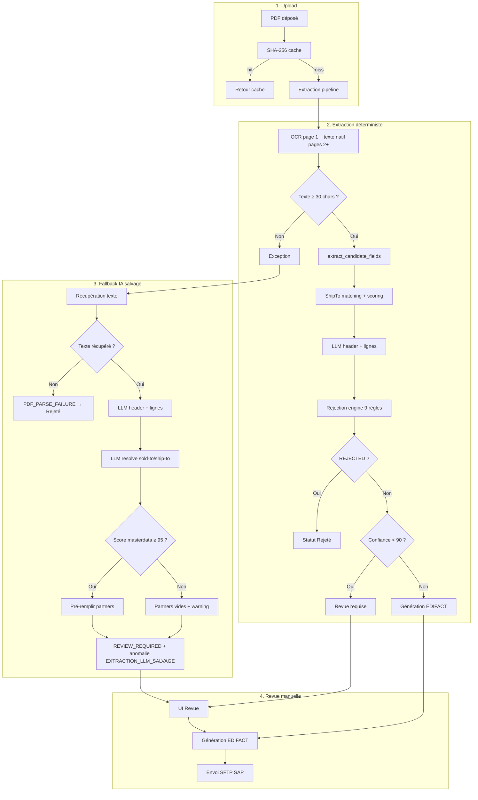

# Pipeline d'extraction PDF → Revue → EDIFACT

Documentation du flux de traitement File2EDI / GenieCommande (août 2026).

---

## Vue d'ensemble

---

## Étapes détaillées avec points de décision

### Étape 1 — Upload & cache

| # | Action | Point de décision | Si oui | Si non |
|---|--------|-------------------|--------|--------|
| 1.1 | Calcul SHA-256 du PDF | Cache LRU (200 entrées) contient le hash ? | Retour immédiat (cached=true) | Continuer |
| 1.2 | Persistance PDF | — | Fichier dans `data/intake/` | — |
| 1.3 | Création upload DB | — | `file2edi_pdf_uploads` | — |

### Étape 2 — Lecture PDF

| # | Action | Point de décision | Si oui | Si non |
|---|--------|-------------------|--------|--------|
| 2.1 | Ouverture PDF (fitz) | PDF chiffré ? | Auth mot de passe vide | Exception → salvage |
| 2.2 | Page 1 | Texte natif vide ? | OCR Tesseract (fra+eng) | Texte natif |
| 2.3 | Pages 2–20 | Multi-pages ? | Texte natif (pas d'OCR) | Page 1 seule |
| 2.4 | Concaténation | Texte total ≥ 30 chars ? | Continuer extraction | Exception → salvage |

### Étape 3 — Extraction déterministe (`extract_candidate_fields`)

| # | Action | Point de décision | Si oui | Si non |
|---|--------|-------------------|--------|--------|
| 3.1 | Regex engines | TVA, N° commande, montants, dates | Candidats extraits | — |
| 3.2 | ShipTo matching | Confiance primaire = 0 ? | Cross-resolution (TVA, BSTNK) | Garder résultat |
| 3.3 | LLM header (`llm_extract`) | Toujours appelé | N° commande, dates, adresse | — |
| 3.4 | LLM fallback SHIPTO | Confiance = 0 ? | `llm_resolve` + masterdata | — |
| 3.5 | LLM validation | 50 ≤ conf < 80 ? | `llm_validate` anti faux-positif | — |
| 3.6 | Lignes commande | LLM + moteur déterministe | Merge + sanitize | — |
| 3.7 | Scoring SHIPTO | > 1 partner pour sold-to ? | Score evidence-based + LLM fallback | SHIPTO unique |
| 3.8 | Scoring décision | Score ≥ seuil ? | SHIPTO assigné | Confiance = 0 |
| 3.9 | Rejection engine | 9 règles Esker | REJECTED / REVIEW / OK | — |
| 3.10 | EDIFACT builder | Pas REJECTED ? | Génération `.tst` | Skip |

### Étape 4 — Fallback IA salvage (`app/llm_salvage.py`)

Déclenché quand l'étape 2 ou 3 lève une exception.

| # | Action | Point de décision | Si oui | Si non |
|---|--------|-------------------|--------|--------|
| 4.1 | Texte partiel | Buffer ≥ 30 chars ? | Utiliser buffer | Retry OCR toutes pages |
| 4.2 | Retry OCR | Texte récupéré ? | Continuer salvage | Retry texte natif |
| 4.3 | Retry natif | Texte récupéré ? | Continuer salvage | **Rejet PDF_PARSE_FAILURE** |
| 4.4 | `llm_extract` | Header extrait ? | PO, dates, adresse | — |
| 4.5 | `llm_extract_orderlines` | Lignes extraites ? | Articles, qté, prix | — |
| 4.6 | Minimum données | Lignes OU N° commande ? | Continuer | **Rejet** |
| 4.7 | `llm_resolve` | Résolu ? | Candidats sold-to/ship-to | Partners vides |
| 4.8 | Validation masterdata | Code existe dans CSV ? | Vérifier score | Partners vides |
| 4.9 | Auto-fill partners | Score ≥ **95** ET codes valides ? | Pré-remplir sold-to/ship-to | Warning PARTNER_UNRESOLVED |
| 4.10 | Statut final | — | **REVIEW_REQUIRED** + anomalie EXTRACTION_LLM_SALVAGE | — |

### Étape 5 — Mapping revue (`engine_to_order_review`)

| # | Action | Point de décision | Si oui | Si non |
|---|--------|-------------------|--------|--------|
| 5.1 | Statut commande | rejection.decision = REJECTED ? | **Rejeté** | Continuer |
| 5.2 | Confiance | < 90 ou REVIEW_REQUIRED ? | **Revue requise** | Généré / À revoir |
| 5.3 | Anomalies | Codes rejection + dates invalides + matériaux | Liste anomalies UI | — |
| 5.4 | Partners | sold-to / ship-to / bill-to / payer | 4 partenaires | — |
| 5.5 | Traceabilité | salvage=true ? | Label "Extraction OCR (fallback IA)" | Label standard |

### Étape 6 — Revue manuelle (UI)

| # | Action | Point de décision |
|---|--------|-------------------|
| 6.1 | Correction en-tête | Champs éditables → log métier from/to |
| 6.2 | Correction partners | Sélection masterdata |
| 6.3 | Correction lignes | Édition article, qté, prix |
| 6.4 | Génération EDIFACT | Validation profil ELM_STANDARD |
| 6.5 | Envoi SFTP | Upload `.uploading` → rename → stat |

---

## Seuils de confiance

| Seuil | Usage | Action |
|-------|-------|--------|
| **0** | Extraction échouée | → LLM fallback (dans pipeline normal) ou salvage |
| **50–79** | Match faible | → LLM validation anti faux-positif |
| **80+** | Match scoring SHIPTO | → Assignation avec confiance |
| **90** | Seuil revue auto | < 90 → Revue requise obligatoire |
| **95** | Salvage auto-fill partners | Score masterdata ≥ 95 → pré-remplir sold-to/ship-to |

---

## Codes d'anomalie clés

| Code | Sévérité | Quand |
|------|----------|-------|
| `PDF_PARSE_FAILURE` | Bloquant | Aucun texte récupérable, salvage échoué |
| `EXTRACTION_LLM_SALVAGE` | Warning | Salvage IA réussi, revue obligatoire |
| `PARTNER_UNRESOLVED` | Warning | Salvage lignes OK mais partners non validés |
| `ORDER_DATE_INVALID` | Bloquant | Date commande manquante/invalide |
| `DELIVERY_DATE_INVALID` | Warning | Date livraison ligne invalide |
| `NO_VALID_ARTICLE` | Bloquant | Aucun article Bosch valide |

---

## Fichiers clés

| Fichier | Rôle |
|---------|------|
| `server.py` → `_local_process_and_respond` | Orchestration pipeline + salvage |
| `app/extraction.py` | Extraction déterministe + LLM intégré |
| `app/llm_salvage.py` | Fallback IA sur exception |
| `app/engines/llm_resolver.py` | Résolution sold-to/ship-to par LLM |
| `app/engines/llm_orderlines.py` | Extraction lignes par LLM |
| `app/engines/shipto_scoring.py` | Scoring evidence-based SHIPTO |
| `src/file2edi/mapper.py` | Mapping engine → UI revue |
| `src/rejection_catalog.py` | Catalogue 9+ règles de rejet |

---

*Dernière mise à jour : 12 août 2026*
