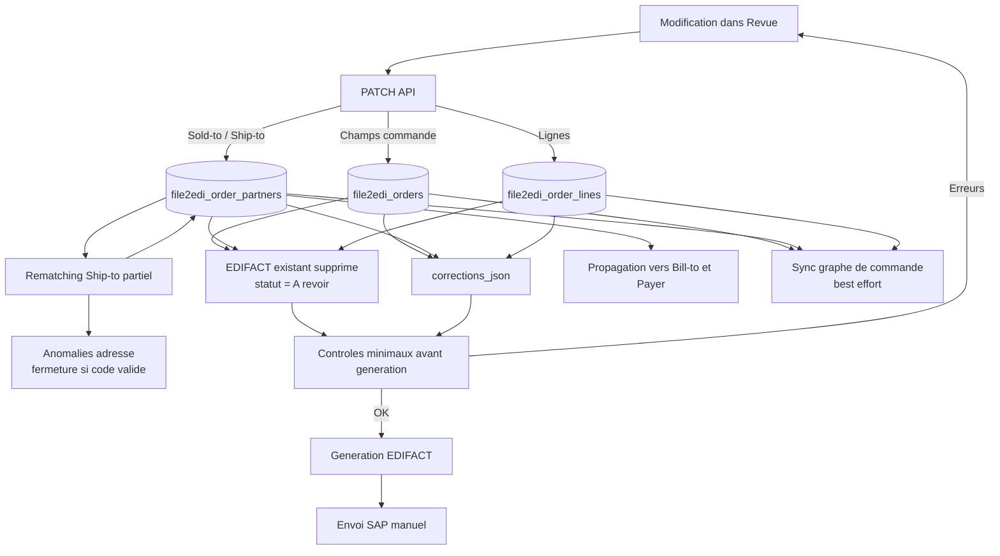
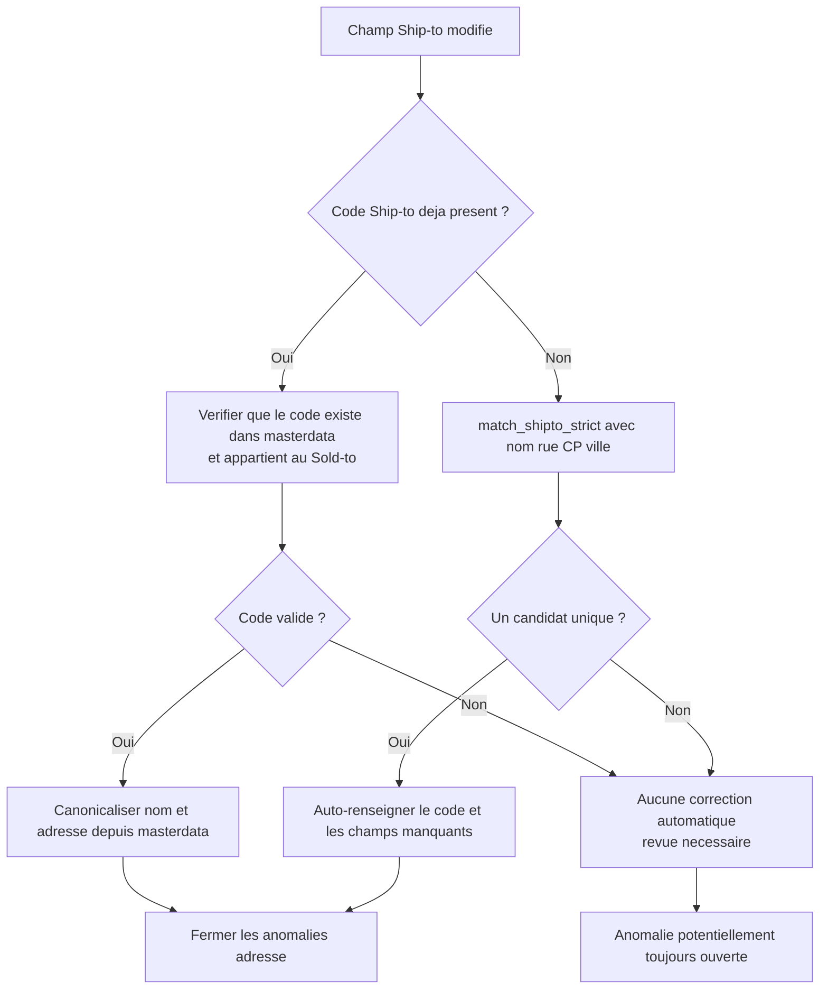

# Propagation des modifications d'une commande en revue

**Périmètre :** commande non encore envoyée à SAP, depuis l'écran Revue.  
**Source de vérité :** tables PostgreSQL `file2edi_orders`, `file2edi_order_partners` et `file2edi_order_lines`.

## 1. Schéma global



## 2. Les trois types d'effet

| Effet | Signification |
|---|---|
| **Direct** | La valeur modifiée est écrite dans sa colonne PostgreSQL. |
| **Propagé** | Une autre entité est modifiée automatiquement à partir de cette valeur. |
| **Invalidant** | L'EDIFACT précédent est supprimé et devra être régénéré. |
| **Revalidé** | Un contrôle est exécuté immédiatement après la modification. |
| **À vérifier plus tard** | La valeur est utilisée à la génération, mais aucun contrôle complet n'est lancé au moment du PATCH. |

## 3. Champs d'en-tête de commande

| Champ UI/API | Table/colonne | Effet direct | Influence sur les autres champs | Contrôle immédiat | Effet EDIFACT |
|---|---|---|---|---|---|
| `clientName` | `file2edi_orders.client_name` | Oui | Aucun recalcul Sold-to/Ship-to | Aucun | EDIFACT invalidé |
| `customerOrderNumber` | `customer_order_number` | Oui | Aucun changement de partenaire | Aucun contrôle de doublon au PATCH | EDIFACT invalidé |
| `documentReference` | `document_reference` | Oui | Aucun | Aucun | EDIFACT invalidé |
| `orderDate` | `order_date` | Oui | Aucun | La présence est contrôlée à la génération | EDIFACT invalidé |
| `requestedDeliveryDate` | `requested_delivery_date` | Oui | Aucun | La présence est contrôlée à la génération | EDIFACT invalidé |
| `currency` | `currency` | Oui | Aucun | Aucun contrôle détaillé au PATCH | EDIFACT invalidé |
| `incoterm` | `incoterm` | Oui | Aucun | Aucun contrôle détaillé au PATCH | EDIFACT invalidé |
| `deliveryMode` | `delivery_mode` | Oui | Aucun | Aucun contrôle détaillé au PATCH | EDIFACT invalidé |

### Particularité du numéro de commande

La modification de `customerOrderNumber` ne relance pas `_check_po_duplicate()` immédiatement. Le doublon peut donc n'être détecté qu'à une autre étape, selon le chemin d'import ou la génération. Ce contrôle reste à compléter dans une évolution dédiée.

## 4. Champs Sold-to / AG

| Champ | Effet direct | Propagation | Risque ou limite |
|---|---|---|---|
| `partnerCode` | Mise à jour du Sold-to et de `file2edi_orders.soldto` | Synchronise Bill-to et Payer avec les valeurs masterdata | Le Ship-to est rematché dans la famille du nouveau Sold-to |
| `partnerName` | Résolution si un nom unique existe dans le masterdata | Propagé vers Bill-to/Payer après résolution | Nom ambigu ou inconnu : anomalie bloquante |
| `addressLine1` | Mise à jour puis canonicalisation si le Sold-to est résolu | Propagé vers Bill-to/Payer | Donnée inconnue : anomalie Sold-to |
| `postalCode` | Mise à jour puis canonicalisation si le Sold-to est résolu | Propagé vers Bill-to/Payer | Donnée inconnue : anomalie Sold-to |
| `city` | Mise à jour puis canonicalisation si le Sold-to est résolu | Propagé vers Bill-to/Payer | Donnée inconnue : anomalie Sold-to |
| `country` | Mise à jour puis canonicalisation si le Sold-to est résolu | Propagé vers Bill-to/Payer | Donnée inconnue : anomalie Sold-to |

La propagation vers Bill-to et Payer conserve la trace de la source de chaque champ : `manual` ou `auto`.

## 5. Champs Ship-to / adresse de livraison

| Champ | Effet direct | Rematching | Propagation | Limite actuelle |
|---|---|---|---|---|
| `partnerCode` | Mise à jour du code Ship-to | Vérifie le code dans la famille du Sold-to | Remplit les champs depuis le masterdata | Code incompatible : anomalie bloquante |
| `partnerName` | Mise à jour du nom et du `client_name` de la commande | Oui, rematching déclenché | Peut fermer les anomalies adresse | Le nom seul ne suffit pas toujours à prouver le bon Ship-to |
| `addressLine1` | Mise à jour de la rue | Rematching même si un code existait | Remplace par le partenaire canonique si unique | Aucun candidat unique : anomalie bloquante |
| `postalCode` | Mise à jour du code postal | Rematching même si un code existait | Remplace par le partenaire canonique si unique | Aucun candidat unique : anomalie bloquante |
| `city` | Mise à jour de la ville | Rematching même si un code existait | Remplace par le partenaire canonique si unique | Aucun candidat unique : anomalie bloquante |
| `country` | Mise à jour du pays | Déclenche le même contrôle de cohérence | Canonicalisation si partenaire résolu | Le pays n'est pas utilisé comme preuve de matching |

### Rematching Ship-to actuel



Le rematching utilise le Sold-to courant pour limiter la famille de partenaires. Une sélection de code ou une correspondance unique rend le masterdata autoritaire pour l'identité et l'adresse du partenaire. Une absence de correspondance crée `SHIPTO_MASTERDATA_MISMATCH` ou `SHIPTO_SOLDTO_MISMATCH` et bloque la génération.

## 6. Lignes de commande

Même si elles ne sont pas l'en-tête, les lignes influencent directement la génération :

| Champ | Effet |
|---|---|
| Article | Mise à jour de la ligne, EDIFACT invalidé |
| Quantité | Recalcul du montant de ligne et du total commande |
| Prix unitaire | Recalcul du montant de ligne et du total commande |
| Désignation | Mise à jour directe |
| Statut/commentaire | Mise à jour de revue |

Une modification de quantité ou de prix recalcule `amount` puis `total_amount` et `line_count`.

## 7. Ce qui se passe après chaque modification

1. Le PATCH écrit la valeur en base.
2. `corrections_json` est reconstruit.
3. L'EDIFACT existant est supprimé.
4. Le statut passe à `À revoir`.
5. `review_required` passe à `1`.
6. Le graphe de commande est synchronisé en best effort.
7. La revue retournée à l'interface contient les valeurs actualisées.

Le bouton **Enregistrer** ne relance pas l'extraction PDF et ne relance pas toutes les règles métier. Il rafraîchit principalement le snapshot des corrections.

## 8. Contrôles exécutés à la génération EDIFACT

Avant de générer, le système contrôle notamment :

- numéro de commande présent ;
- date de commande présente ;
- Sold-to présent ;
- Ship-to présent ;
- au moins une ligne ;
- article présent sur chaque ligne ;
- quantité présente ;
- absence d'anomalie ouverte ou bloquante.

Les valeurs courantes de la revue sont ensuite utilisées pour construire l'EDIFACT : les corrections d'adresse, de Ship-to et de Sold-to sont donc bien prises en compte à cette étape.

## 9. Exemple de propagation

### Cas : changement du code postal

```text
Avant :
  Ship-to = 15000001
  Rue = 10 rue A
  Code postal = 69000
  Ville = Lyon

Action utilisateur :
  Code postal = 69100

Effets actuels :
  1. postal_code devient 69100 en base
  2. edited_fields.postalCode = manual
  3. EDIFACT existant supprimé
  4. Statut = À revoir
  5. Le code existant est rematché avec l'adresse complète
  6. Si un Ship-to unique correspond, le code et les champs sont canonicalisés
  7. Sinon, SHIPTO_MASTERDATA_MISMATCH est créée et la génération est bloquée
```

Une adresse libre n'est donc plus acceptée silencieusement avec un ancien code Ship-to : elle doit correspondre à un partenaire unique ou rester en anomalie.

## 10. Règles de cohérence recommandées

Pour sécuriser la propagation :

1. Après toute modification du Sold-to, rematcher le Ship-to dans la famille du nouveau Sold-to. **Implémenté.**
2. Après toute modification de rue, code postal ou ville, vérifier le couple `Ship-to + adresse`, même si un code existe déjà. **Implémenté.**
3. En cas de désaccord, créer une anomalie explicite au lieu de fermer automatiquement `DELIVERY_ADDRESS_INVALID`. **Implémenté.**
4. Relancer le contrôle de doublon lorsque `customerOrderNumber` change. **À compléter.**
5. Bloquer les PATCH lorsque la commande a déjà été envoyée à SAP. **Implémenté.**
6. Synchroniser le miroir de conversion immédiatement après une correction, et pas seulement à la génération EDIFACT. **À vérifier selon le backend miroir.**
