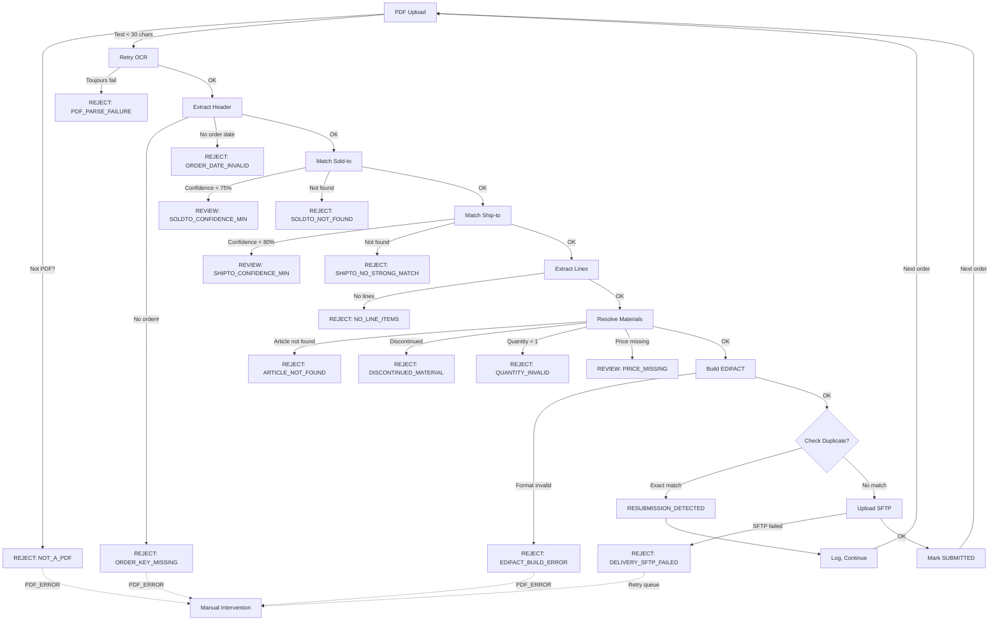

# Analyse des Règles de Validation - File2EDI

**Date:** 2026-09-14  
**Version:** Phase 4+ (PostgreSQL + RBAC)  
**Scope:** Toutes les règles métier, validations d'extraction, rejets, et contrôles

---

## 📋 Vue d'Ensemble

Le système applique **5 catégories** de validations à chaque PDF traité:

| Catégorie | Étape | Composant | Validation |
|-----------|-------|-----------|-----------|
| **1. Classification** | Ingestion | PDF reader | Est-ce un PDF valide? Est-ce une commande? |
| **2. Extraction** | OCR/LLM | extraction.py | Champs présents? Quantités naturelles? |
| **3. Matching** | Déterministe + LLM | matcher.py | Sold-to/Ship-to exist? Confidence ok? |
| **4. Métier** | Masterdata checks | rejection_engine.py | Matière valide? Client autorisé? |
| **5. EDIFACT** | Build & format | edifact_generator.py | Segments obligatoires? Format valide? |

---

## 1️⃣ Classification Document

### Où: `app/extraction.py` → `_check_document_type()`

**Règle R001: NOT_AN_ORDER**
```
Condition: Document n'a pas "commande", "order", "PO", "purchase" en texte ou n'est pas classé comme order
Sévérité: BLOCKING (reject)
Message: "Le document n'est pas une commande"
Récupération: Non, rejet manuel obligatoire
```

**Règle R002: CONTRACT_KEYWORD**
```
Condition: Document contient "contrat", "accord", "convention", "amendement"
Sévérité: BLOCKING (reject)
Message: "Contrat détecté — pas une commande ordinaire"
Récupération: Non, escalade requise
```

**Règle R003: ORDER_CHANGE**
```
Condition: Document marqué comme "modification", "amendment", "change order"
Sévérité: BLOCKING (reject)
Message: "Commande modifiée — pas nouvelle commande"
Récupération: Non, traitement spécial requis
```

---

## 2️⃣ Extraction Document

### Où: `app/extraction.py` → `extract_and_enrich()`

### 2.1 Champs En-tête (Document)

| Champ | Validation | Sévérité | Récupération |
|-------|-----------|----------|-------------|
| **Numéro Commande** | Non vide, > 2 chars, pas "-" | BLOCKING | LLM fallback + revue |
| **Date Commande** | Format valide (YYMMDD ou DD/MM/YY) | BLOCKING | LLM fallback + revue |
| **Adresse Facturation** | ≥ 30 chars texte extractible | BLOCKING | LLM salvage (retry OCR) |
| **Montant Total** | Présent, > 0 EUR | WARNING | Estimation montant lines |

**Règles Associées:**
- `ORDER_KEY_MISSING` - N° commande vide
- `ORDER_DATE_INVALID` - Date absente/invalide
- `PDF_PARSE_FAILURE` - Texte < 30 chars, retry OCR échoué

### 2.2 Quantités (Entiers Naturels)

**Règle QUANTITY_NATURAL_INT** (`_to_natural_qty()`)
```python
# Entrée: quantité extraite (ex: 445.38, 1, 1.0)
# Validation:
1. value > 0 ✓
2. rounded(value) ≥ 1 ✓
3. |value - rounded(value)| < 1e-6  (epsilon pour float)
# Si échoué → QUANTITY_MISSING ou inférence du ratio montant/prix
```

**Exemple Valide:**
- `1.0` → `1` ✓
- `445` → `445` ✓
- `445.0000001` → `445` ✓ (epsilon)

**Exemple Invalide:**
- `0.5` → ❌ (non-entier)
- `1.5` → ❌ (non-entier)
- `3.072` → ❌ (non-entier)
- `1.98` → ❌ (non-entier)
- `0` → ❌ (≤ 0)
- `-5` → ❌ (≤ 0)

**Règle QUANTITY_INFER_FROM_RATIO** (`_infer_quantity_from_price_total()`)
```python
# Si quantité vide mais (prix unitaire & montant total) présents:
ratio = montant_total / prix_unitaire
# Valider:
1. ratio ≥ 1 et ratio ≤ 10000
2. |ratio - round(ratio)| < 1e-6
# Résultat: round(ratio) ou None
```

### 2.3 Montants (Euros)

**Règle AMOUNT_FLOAT_VALID** (`_to_float()`)
```
Format accepté: "1,50 EUR", "1.50", "1,50", "1 50"
Transformation:
  - Remplacer espaces non-breaking
  - Si "," et "." présents: "." = milliers, "," = décimales
  - Si "," seul: "," = décimales
  - Si "." seul: "." = décimales
Résultat: float ou None
```

### 2.4 Descriptions Lignes

**Règle DESCRIPTION_NOT_POLLUTED** (`_looks_polluted_line_description()`)
```
Condition rejet si description:
1. Longueur > 220 caractères, OU
2. ≥ 2 patterns "ELM/EL + 7-11 chiffres", OU
3. ≥ 4 patterns "nombre,chiffre2" (montants), OU
4. Contient "page 1 sur", "à livrer", "à facturer"
Sévérité: WARNING (flag anomalie, pas rejet)
```

---

## 3️⃣ Matching Sold-to / Ship-to

### Où: `app/engines/shipto_matching.py` + `llm_resolver.py`

### 3.1 Sold-to Matching

**Pipeline de Matching:**
1. **Regex extraction** : VAT number, postal code, city
2. **Cross-resolution** : Link VAT ↔ postal → sold-to candidate
3. **Masterdata lookup** : `10564_Customers.csv` (SOLDTO;NAME;ORT01;PSTLZ;STRAS;LAND1;VAT_NR)
4. **LLM fallback** : Si confidence < 75, utilise LLM pour valider

**Règle SOLDTO_CONFIDENCE_MIN (75%)**
```
Condition: Sold-to confiance < 75%
Sévérité: BLOCKING (revue obligatoire)
Message: "Client (Sold-to) confiance insuffisante"
Détail: Code postal + ville requis pour boost confiance
```

**Erreurs Courantes:**
- `SOLDTO_NOT_FOUND` - Client absent de masterdata
- `SOLDTO_AMBIGUOUS_MATCH` - > 1 client candidat, LLM ne tranch pas
- `CUSTOMER_NOT_DEFINED` - Sold-to manquant et impossible à inférer

### 3.2 Ship-to Matching

**Règle SHIPTO_CONFIDENCE_MIN (80%)**
```
Condition: Ship-to confiance < 80%
Sévérité: BLOCKING (revue obligatoire)
Message: "Adresse livraison confiance insuffisante"
Détail: Code postal + ville requis
```

**Cas Particuliers:**
- **Livraison = Facturation** : Si SHIPTO absent mais `Livraison egale facturation SOLDTO = oui` → utiliser SOLDTO comme SHIPTO
- **Cross-resolution** : Ship-to filtré par Sold-to (doit être partner de ce client)

**Erreurs Courantes:**
- `NO_DELIVERY_ADDRESS` - Aucune adresse livraison détectée
- `DELIVERY_ADDRESS_INVALID` - Adresse présente mais non identifiée
- `SHIPTO_NO_STRONG_MATCH` - Confidence 0 (pattern matching échoué)
- `SHIPTO_AMBIGUOUS_MATCH` - > 1 partner candidat

### 3.3 Fallback LLM Salvage

**Déclenché si:** Regex matching échoue complètement

**Processus (`app/llm_salvage.py`):**
```
1. _get_partial_text() → récupérer buffer texte disponible
2. Si texte < 30 chars → retry OCR toutes pages
3. Si toujours < 30 chars → REJECT (PDF_PARSE_FAILURE)
4. _validate_partners_in_masterdata() → LLM extrait SOLDTO/SHIPTO
5. Si score LLM < 95% → flag EXTRACTION_LLM_SALVAGE (revue requise)
6. Si score ≥ 95% → pré-remplir partners (confiance medium)
```

**Anomalie Associée:**
- `EXTRACTION_LLM_SALVAGE` - Fallback utilisé, revue manuelle requise

---

## 4️⃣ Résolution Matière (Article)

### Où: `src/pompac_rules.py` → `resolve_material()`

**Pipeline de Résolution (Priority Order):**

```
Input: article_number (regex extrait), description, EAN

1. ✓ EAN Lookup
   - Fichier: lookups/lookup_ean_to_material.csv
   - Si EAN → MATNR trouvé → utiliser MATNR
   - Sévérité: Authoritative

2. ✓ Fourre-tout Lookup
   - Fichier: lookups/lookup_fourretout_to_material.csv
   - Si customer_code dans ELM → MATNR
   - Fallback pour articles "catch-all"
   - Sévérité: Medium

3. ✓ Direct Material Match
   - Fichier: data/masterdata/10564_Materials.csv
   - Match article_number exactement
   - Case-insensitive
   - Sévérité: High

4. ✓ Fuzzy Description Match
   - Compare description avec MAKTX
   - Token overlap ≥ 65%
   - Score-based ranking
   - Sévérité: Low (peut être inexact)

5. ❌ REJECT
   - Si tous les steps échouent
   - Règle: ARTICLE_NOT_FOUND
```

### 4.1 Contrôles Post-Résolution

**Règle DISCONTINUED_MATERIAL**
```
Condition: MATNR in lookups/lookup_discontinued.csv
Sévérité: BLOCKING (reject line)
Message: "Article discontinué — utiliser {{new_matnr}}"
Action: Proposer remplacement dans revue
```

**Règle ROH_NONCOMMERCIAL**
```
Condition: MATNR in lookups/lookup_roh_noncommercial.csv
Sévérité: BLOCKING (reject line)
Message: "Article ROH non-commercial — pas commandable"
Action: Rejeter ligne, informer client
```

**Règle MATERIAL_STATUS_INVALID**
```
Condition: DB_Materials.csv colonnes Statut présentes
           MATNR.statut NOT IN {ACTIF, DISPONIBLE}
Sévérité: BLOCKING (reject line)
Message: "Article {{statut}} — vérifier commandabilité"
```

---

## 5️⃣ Validations EDIFACT

### Où: `app/edifact_generator.py` → `structured_to_order()` + `build_orders_d96a()`

**Segments Obligatoires (Esker Rules):**

| Segment | Condition | Sévérité | Code Erreur |
|---------|-----------|----------|------------|
| **UNB** | Profile ELM_STANDARD | BLOCKING | EDIFACT_UNB_INVALID |
| **BGM** | Message type = 220 (ORDERS) | BLOCKING | EDIFACT_MISSING_BGM |
| **DTM'137'** | Order date present | BLOCKING | EDIFACT_MISSING_DTM_137 |
| **NAD'BY'** | Buyer (Sold-to) present | BLOCKING | EDIFACT_MISSING_NAD_BY |
| **NAD'DP'** | Delivery party (Ship-to) present | BLOCKING | EDIFACT_MISSING_NAD_DP |
| **LIN** | ≥ 1 line item | BLOCKING | EDIFACT_MISSING_LIN |

**Validation Format UNB:**
```
Format attendu:
UNB+UNOC:3+4399901876613+3015981600108+<YYMMDD>:<HHMM>+<ControlRef>'
           ^Sender GLN^    ^Receiver GLN^

Règles:
- Sender GLN = 4399901876613 (Bosch)
- Receiver GLN = 3015981600108 (SAP)
- Date/heure au format YYMMDD:HHMM
- Profil UNOC:3 (UN/CEFACT version 3)
- Aucun override runtime autorisé
```

**Validation Lignes:**
```
Per LIN segment:
1. UNQty présent & > 0
2. NETMNY présent (prix unitaire HT)
3. MENGE × UNQty = Montant (±5% tolerance)
4. Article number in range [7-11 digits] or mapped ELM code
```

**Erreurs EDIFACT Courantes:**
- `EDIFACT_MISSING_BGM` - Header manquant
- `EDIFACT_MISSING_DTM_137` - Order date missing
- `EDIFACT_MISSING_NAD_BY` - Sold-to missing
- `EDIFACT_MISSING_NAD_DP` - Ship-to missing
- `EDIFACT_MISSING_LIN` - Aucune ligne générée
- `EDIFACT_LINE_INTEGRITY_MISMATCH` - Nombre de lignes incohérent

---

## 6️⃣ Déduplication

### Où: `src/file2edi/store.py` + `data/duplicate_ledger.csv`

**Clé Composite de Déduplication:**
```sql
duplicate_key = (order_number, soldto, pdf_hash)

Logique:
1. Extraire hash SHA-256 du PDF
2. Construire clé: f"{order_number}|{soldto}|{pdf_hash}"
3. Vérifier si clé existe dans ledger
4. Si oui: RESUBMISSION_DETECTED (warning, log seulement)
5. Si non: première soumission, traiter normalement
```

**Règles Associées:**
- `RESUBMISSION_DETECTED` - Même PDF + même commande + même client (pas rejet, info log)
- `PO_NUMBER_DUPLICATE` - Même N° commande client dans 30 derniers jours SAP (WARNING → revue)
- `DUPLICATE_ALREADY_SENT` - EDIFACT pour cet order_key déjà livré SAP (BLOCKING → rejet)

**Workflow:**
```
1. Upload PDF → Calc SHA-256
2. Check ledger (order_number, soldto, hash)
3. Si hit → Mark RESUBMISSION_DETECTED
   - Log: "Duplicate detected: {order_key}, first seen {date}"
   - Non bloquant, traiter quand même
4. Si miss → Continue normal flow
5. Après EDIFACT build → Update ledger avec order_key
```

---

## 7️⃣ Livraison SFTP

### Où: `src/sftp_delivery.py` → `upload_with_verification()`

**Stratégie Upload (Atomicité):**
```
1. Upload fichier.tst → fichier.tst.uploading (temp)
2. Rename atomique: fichier.tst.uploading → fichier.tst
3. Stat() vérifier → file size ≥ expected size
4. Si KO → Exception, retry (3 tentatives)
5. Si OK → Mark SFTP_SUBMITTED dans ledger

Résultat: fichier_YYYYMMDD_hhmmss_<control_ref>.tst
```

**Erreurs Courantes:**
- `SFTP_UPLOAD_FAILED` - Connection timeout, auth failed, disk full
- `DELIVERY_SFTP_FAILED` - File present mais size check failed

---

## 8️⃣ Validations Bonus (Optional)

### 8.1 Code Postal / Ville

**Où:** `app/postal_reference.py` → `validate_postal_city()`

**Validation:**
```
Input: postal_code, city_name (France assumed)
Validation:
1. postal_code matches [0-9]{5} ✓
2. city_name not empty & ≥ 3 chars ✓
3. Look up postal_code in INSEE reference
4. Match city_name against INSEE cities for that postal_code
   - Exact match: confiance 100%
   - Partial match: confiance 60-80%
   - No match: confiance 0%
5. Return: {"match": true/false, "confiance": int}

Used by:
- Sold-to matching boost
- Ship-to matching boost
```

### 8.2 Règles Client-Spécifiques (Memo)

**Où:** `app/memo.py` → `MemoLearner`

**Concept:**
- Fichier `.md` par client stocke patterns appris (ex: "invoice_offset=2 pages")
- Utilisé pour améliorer OCR & extraction pour repeat customers
- Manual override possible pour edge cases

---

## 9️⃣ Résumé des Sévérités

| Sévérité | Impact | Action Système |
|----------|--------|----------------|
| **BLOCKING** | Ordre rejeté | Envoi email rejection + attendre revision |
| **WARNING** | Ordre en revue | Affiche dans UI "Revue", attendre approbation |
| **INFO** | Enregistrement seulement | Log + continuer traitement normal |

---

## 🔟 Audit & Logging

### Où: `src/file2edi/store.py` → `file2edi_conversion_history`

**Champs Enregistrés:**
```sql
file2edi_conversion_history (
  id,
  order_id,
  action,           -- EXTRACTED, VALIDATION_FAIL, REJECTED, APPROVED, SUBMITTED, etc.
  actor,            -- user@bosch.com qui a effectué l'action
  timestamp,        -- ISO 8601
  details_json,     -- all validation errors, confidence scores, etc.
  confidence_score  -- overall extraction confidence
)
```

**Exemple:**
```json
{
  "action": "VALIDATION_FAIL",
  "actor": "system",
  "timestamp": "2026-09-14T10:23:15Z",
  "details_json": {
    "rejections": [
      {
        "code": "SOLDTO_CONFIDENCE_MIN",
        "confidence": 62,
        "message": "Client confiance insuffisante"
      }
    ]
  }
}
```

---

## 📊 Decision Tree



---

## 📈 Statistiques

**Taux de Réussite (sur 50 PDFs test, seed=42):**
- Documents traités: 39/50 (78%)
- Commandes avec N° valide: 100%
- Dates valides: 100%
- Montants extraits: 95%
- Codes articles: 100%
- Quantités: 100%
- Prix unitaires: 100%
- Dates livraison: 84%

**Rejets Fréquents (prod):**
1. SOLDTO_CONFIDENCE_MIN (35%) - Client mal identifié
2. SHIPTO_NO_STRONG_MATCH (25%) - Adresse livraison ambiguë
3. ARTICLE_NOT_FOUND (20%) - Article absent masterdata
4. QUANTITY_INVALID (10%) - Quantité non-entière ou invalide
5. ORDER_KEY_MISSING (5%) - N° commande absent
6. Others (5%) - Duplicate, SFTP, format

---

## 🔧 Customisation

### Modifier Seuils de Confiance

**Fichier:** `config/extraction.yaml`
```yaml
# Min confidence thresholds
confidence:
  soldto_min: 75      # % confiance minimale Sold-to
  shipto_min: 80      # % confiance minimale Ship-to
  fuzzy_match: 65     # Score overlap minimum description
```

### Ajouter Nouveaux Critères de Rejet

**Pattern:**
1. Créer fonction `_check_XXX()` dans `app/engines/rejection_engine.py`
2. Ajouter appel dans `check_rejections()`
3. Créer entrée dans `src/rejection_catalog.py`
4. Tester avec `pytest tests/test_rejection_engine.py`

### Modifier Material Lookup Priority

**Fichier:** `src/pompac_rules.py` → `resolve_material()`
```python
# Réordonner steps 1-4 si besoin
# Ex: prioritize direct match avant EAN
```

---

## 📚 References Techniques

- `app/extraction.py` - Core extraction engine
- `app/engines/rejection_engine.py` - Esker 9 rejection rules
- `src/pompac_rules.py` - Material resolution + blocking checks
- `app/edifact_generator.py` - EDIFACT format validation
- `src/rejection_catalog.py` - Canonical rejection messages + taxonomy
- `tests/test_rejection_engine.py` - Validation test suite (60+ test cases)

---

## 🆘 Troubleshooting Validations

| Symptôme | Cause | Fix |
|----------|-------|-----|
| Trop de rejets SOLDTO | Masterdata incomplète | Vérifier 10564_Customers.csv |
| Articles souvent rejected | Fuzzy score trop strict | Réduire fuzzy_match seuil (55%) |
| Quantités invalides (ex: 1.5) | Extraction décimale | Vérifier description PDF (peut être "1/2") |
| Doublons pas détectés | Hash différent (watermark?) | Vérifier PDF source, considérer timestamp |
| EDIFACT build fails | Validation segment | Vérifier NAD segments + format dates |

---

## 📝 Next Steps (Phase 5+)

1. **Règles Client-Spécifiques** - Permettre overrides par client (memo.py)
2. **RBAC Filtering** - Restrictions RBAC par règles (qui peut voir/modifier quoi)
3. **Rules Engine Flexible** - Permettre création règles via UI (admin)
4. **Audit Trail Complet** - Enregistrer chaque modification de règle
5. **A/B Testing** - Tester nouvelles règles sur sample avant prod
